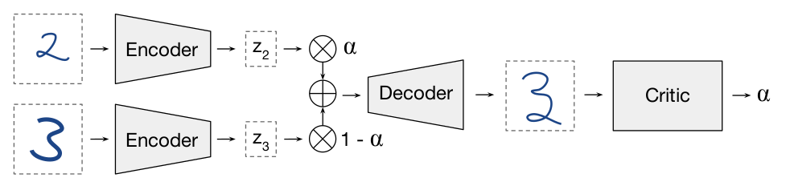
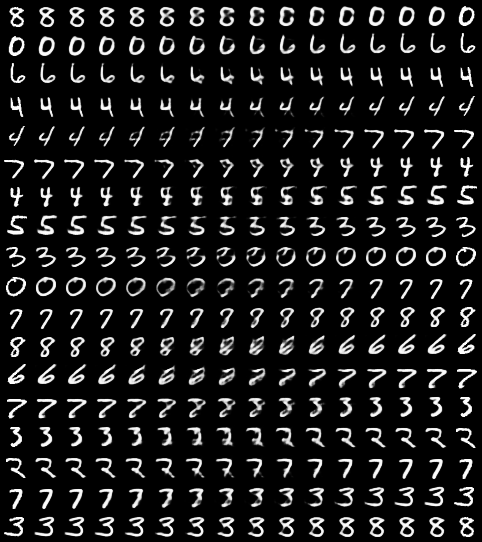

# AutoEncoders in PyTorch

[](https://pytorch.org/)


-------------------------

## Description

This repo contains an implementation of the following AutoEncoders:

* [Vanilla AutoEncoders - **AE**](http://ufldl.stanford.edu/tutorial/unsupervised/Autoencoders/): </br>
  The most basic autoencoder structure is one which simply maps input data-points through a __bottleneck layer__ whose dimensionality is smaller than the input.

* [Variational AutoEncoders - **VAE**](): </br>
  The Variational Autoencoder introduces the constraint
that the latent code `z` is a random variable distributed according to a prior distribution `p(z)`.

* [Adversarially Constrained Autoencoder Interpolations - **ACAI**](https://arxiv.org/pdf/1807.07543):</br>
A critic network tries to predict the interpolation coefficient α corresponding to an interpolated datapoint. The autoencoder is
trained to fool the critic into outputting α = 0.</br>


-------------------------

## Setup

### Create a Python Virtual Environment
```
mkvirtualenv --python=/usr/bin/python3 pytorch-AE
```

###  Install dependencies
```
pip install tensorflow
```

-------------------------

## Training
```
python train.py --help
```

### Training Options:

* **Vanilla Autoencoder:**
  ```
  python train.py --model AE
  ```

* **Variational Autoencoder:**
  ```
  python train.py --model VAE
  ```

-------------------------

## Results

| Vanilla AutoEncoders       |  Variational AutoEncoders  | ACAI          |
|------------------------- |------------------------- | --------------------|
|   |  | |


### Contributing:
If you have suggestions or any type of contribution idea, file an issue, make a PR
and **don't forget to star the repository**

### More projects:
Feel free to check out my other repos with more work in Machine Learning:

* [World Models in TensorFlow](https://github.com/dariocazzani/World-Models-TensorFlow)
* [TensorBlob](https://github.com/dariocazzani/TensorBlob)
* [banaNavigation](https://github.com/dariocazzani/banaNavigation)
